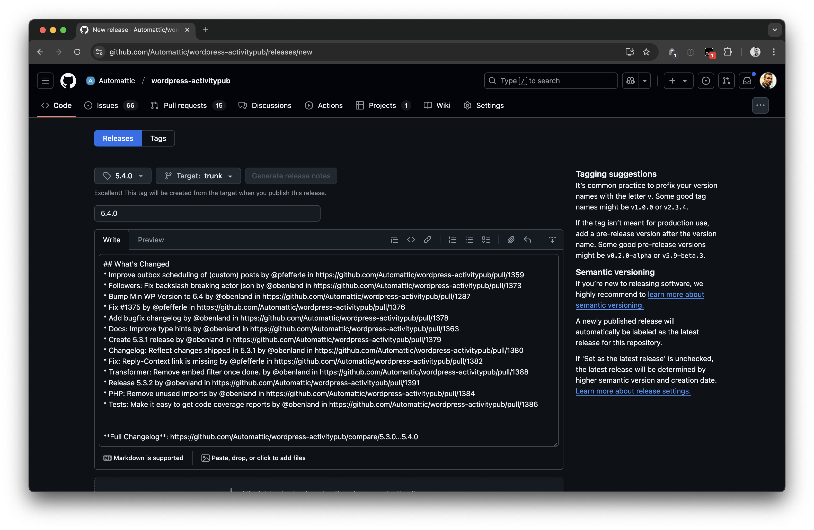
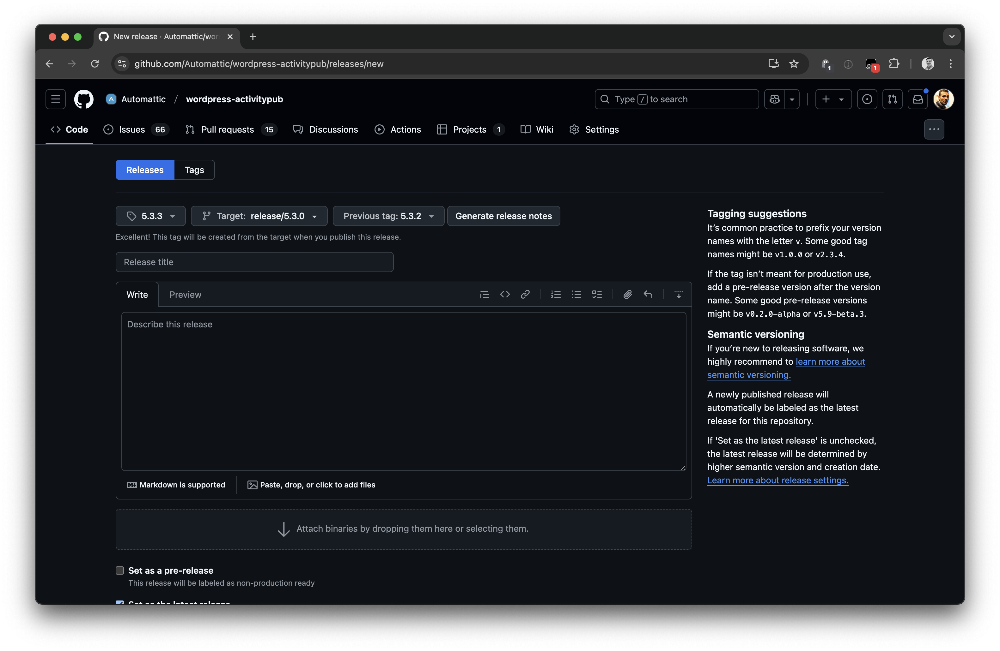

# Release Process

This document outlines the process for creating new releases of the WordPress ActivityPub plugin. The process differs slightly between major/minor releases and patch releases.

## Major and Minor Releases

Major and minor releases follow the same release process. These releases are created from the `trunk` branch.

### Steps

1. **Generate Version Bump PR**
   - Use the release script to automatically generate a version bump pull request:
     ```bash
     # From the plugin root directory
     npm run release
     ```
   - The script will:
     - Prompt for the new version number
     - Update version numbers in relevant files
     - Update the changelog
     - Create a new branch
     - Commit changes
     - Push to GitHub
     - Create a pull request

2. **Review and Merge**
   - Review the generated PR to ensure all version numbers and changelog entries are correct.
   - Once approved, merge the PR into `trunk`.

3. **Create Release**
   - On GitHub, navigate to the main page of the repository.
   - To the right of the list of files, click **Releases**.
   - At the top of the page, click **Draft a new release**. 
   - To choose a tag for the release, select the **Choose a tag** dropdown menu.
     - Type the version number for your release, then click **Create new tag**.
   - Select the **Target** dropdown menu, then click `trunk`.
   - Select the **Previous tag** dropdown menu, then click the tag that identifies the previous release.
   - Above the description field, click **Generate release notes**.
   - If you're ready to publicize your release, click **Publish release**.
   

## Patch Releases

Patch releases require a more manual process as they need to be created from the previous release branch.

### Steps

1. **Restore Release Branch**
   - Locate the most recent release branch (for `5.3.0` it was [#1371](https://github.com/Automattic/wordpress-activitypub/pull/1371)).
   - If needed, recreate the branch from the last release tag.

2. **Create Version PR**
   - Base the version PR on PR [#1192](https://github.com/Automattic/wordpress-activitypub/pull/1192).
   - The release script doesn't support releasing patch versions, so you'll need to manually update version numbers and changelog entries.
   - Manually update version numbers in relevant files.
   - Manually update changelog and readme.txt with the patch version number above the entries that will be part of the release.

3. **Cherry-pick Changes**
   - Identify merge commits from `trunk` that need to be included.
   - Cherry-pick each merge commit into the release branch:
     ```bash
     # Checkout the release branch.
     git checkout release/5.3.0

     # Cherry-pick a merge commit.
     git cherry-pick -m 1 <commit-hash>
     ```
     > Note: The `-m 1` flag is required when cherry-picking merge commits. Merge commits have two parent commits - the first parent (`-m 1`) is the target branch of the original merge (usually the main branch), and the second parent (`-m 2`) is the source branch that was being merged. We use `-m 1` to tell Git to use the changes as they appeared in the main branch.

4. **Resolve Conflicts**
   - Common conflict areas:
     - `CHANGELOG.md`
     - `readme.txt`
   - Resolve conflicts maintaining chronological order in changelog.
   - Ensure version numbers are correct.

5. **Create Release**
   - On GitHub, navigate to the main page of the repository.
   - To the right of the list of files, click **Releases**.
   - At the top of the page, click **Draft a new release**. 
   - To choose a tag for the release, select the **Choose a tag** dropdown menu.
     - Type the version number for your release, then click **Create new tag**.
   - Select the **Target** dropdown menu, then click the branch that contains the patches you want to release.
   - Select the **Previous tag** dropdown menu, then click the tag that identifies the previous release.
   - Above the description field, click **Generate release notes**.
   - If you're ready to publicize your release, click **Publish release**.
   
